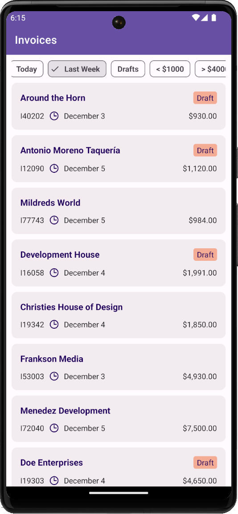

# Chip Filters for a CollectionView

This example illustrates how to add chips with predefined filters (and apply pre-defined filters against data displayed in the DevExpress .NET MAUI [CollectionView](https://docs.devexpress.com/MAUI/403324) control).



**Related Controls and Their Properties**: 
* [FilterChipGroup](https://docs.devexpress.com/MAUI/DevExpress.Maui.Editors.FilterChipGroup): [ItemsSource](https://docs.devexpress.com/MAUI/DevExpress.Maui.Editors.ChipGroup.ItemsSource), [SelectedItems](https://docs.devexpress.com/MAUI/DevExpress.Maui.Editors.FilterChipGroup.SelectedItems), [DisplayMember](https://docs.devexpress.com/MAUI/DevExpress.Maui.Editors.ChipGroup.DisplayMember)
* [DXCollectionView](https://docs.devexpress.com/MAUI/403324): [ItemsSource](https://docs.devexpress.com/MAUI/DevExpress.Maui.CollectionView.DXCollectionView.ItemsSource), [FilterString](https://docs.devexpress.com/MAUI/DevExpress.Maui.CollectionView.DXCollectionView.FilterString), [ItemTemplate](https://docs.devexpress.com/MAUI/DevExpress.Maui.CollectionView.DXCollectionView.ItemTemplate)

## Implementation Details

* This project uses the [FilterChipGroup](https://docs.devexpress.com/MAUI/DevExpress.Maui.Editors.FilterChipGroup) control to display chips with predefined filters. The [FilterChipGroup.ItemsSource](https://docs.devexpress.com/MAUI/DevExpress.Maui.Editors.ChipGroup.ItemsSource) property is bound to the *PredefinedFilters* collection. Each item in this collection contains a value and corresponding display text. The value is specified using [Criteria Language Syntax](https://docs.devexpress.com/CoreLibraries/4928/devexpress-data-library/criteria-language-syntax).

    ```xml
    <dxe:FilterChipGroup ItemsSource="{Binding PredefinedFilters}" SelectedItems="{Binding SelectedFilters, Mode=TwoWay}"
    ```

    ```csharp
    public class MainViewModel : BindableBase {
        string filter;
        public ObservableCollection<FilterItem> PredefinedFilters {
            get;
            set;
        }
        public BindingList<FilterItem> SelectedFilters {
            get;
            set;
        }
        public MainViewModel() {
            SelectedFilters = new BindingList<FilterItem>();
            PredefinedFilters = new ObservableCollection<FilterItem>() {
                new FilterItem(){ DisplayText= "Today", Filter = "IsOutlookIntervalToday([CreatedDate])" },
                new FilterItem(){ DisplayText= "Last Week", Filter = "IsThisWeek([CreatedDate])" },
                new FilterItem(){ DisplayText= "Drafts", Filter = "[IsDraft] == True" },
                new FilterItem(){ DisplayText= "< $1000", Filter = "[Price] < 1000" },
                new FilterItem(){ DisplayText= "> $4000", Filter = "[Price] > 4000" },
            };
    }
    ```

* The [FilterChipGroup.SelectedItems](https://docs.devexpress.com/MAUI/DevExpress.Maui.Editors.FilterChipGroup.SelectedItems) property returns a `BindingList`. You can handle the [BindingList.ListChanged](https://learn.microsoft.com/en-us/dotnet/api/system.componentmodel.bindinglist-1.listchanged) event to update a filter condition. In the event handler, create the filter string and pass it to the [FilterString](https://docs.devexpress.com/MAUI/DevExpress.Maui.CollectionView.DXCollectionView.FilterString) property.

    ```xaml
    <dxcv:DXCollectionView FilterString="{Binding Filter, Mode=TwoWay}" ... 
    ```

    ```cs
    public class MainViewModel : BindableBase 
        string filter;
        public BindingList<FilterItem> SelectedFilters {
            get;
            set;
        }
        public string Filter {
            get {
                return filter;
            }
            set {
                filter = value;
                RaisePropertiesChanged();
            }
        }
        private void SelectedFiltersChanged(object sender, ListChangedEventArgs e) {
            if (SelectedFilters.Count > 0)
                Filter = String.Join(" AND ", SelectedFilters.Select(f => f.Filter));
            else
                Filter = string.Empty;
        }
    }
    ```

