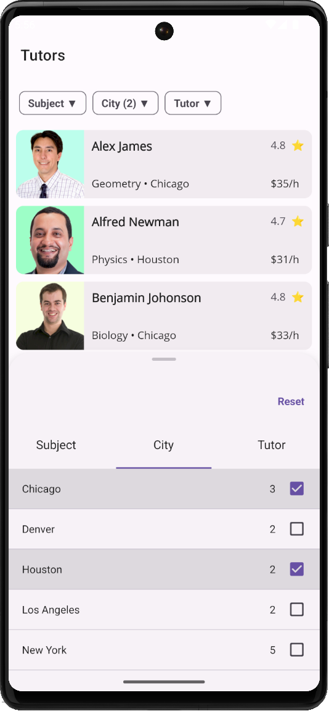

# Display Filtering UI Elements in a BottomSheet

This example places [DXCollectionView](https://docs.devexpress.com/MAUI/403324) Filter UI Elements into a [BottomSheet](https://docs.devexpress.com/MAUI/DevExpress.Maui.Controls.BottomSheet) control.



**Related Controls and Their Properties**: 

* [BottomSheet](https://docs.devexpress.com/MAUI/DevExpress.Maui.Controls.BottomSheet): [HalfExpandedRatio](https://docs.devexpress.com/MAUI/DevExpress.Maui.Controls.BottomSheet.HalfExpandedRatio)
* [DXCollectionView](https://docs.devexpress.com/MAUI/403324): [ItemTemplate](https://docs.devexpress.com/MAUI/DevExpress.Maui.CollectionView.DXCollectionView.ItemTemplate)
* [DXButton](https://docs.devexpress.com/MAUI/DevExpress.Maui.Core.DXButton?v=23.2): [Clicked](https://docs.devexpress.com/MAUI/DevExpress.Maui.Core.DXButtonBase.Clicked?v=23.2), [Command](https://docs.devexpress.com/MAUI/DevExpress.Maui.Core.DXButtonBase.Command?v=23.2)
* [TabView](https://docs.devexpress.com/MAUI/DevExpress.Maui.Controls.TabView): [ItemHeaderTapped](https://docs.devexpress.com/MAUI/DevExpress.Maui.Controls.TabView.ItemHeaderTapped), [Command](https://docs.devexpress.com/MAUI/DevExpress.Maui.Controls.SimpleButton.Command)
* [FilterCheckedListItem](https://docs.devexpress.com/MAUI/DevExpress.Maui.Editors.FilterCheckedListItem): [Context](https://docs.devexpress.com/MAUI/DevExpress.Maui.Editors.FilterItemBase.Context), [ShowSearchPanel](https://docs.devexpress.com/MAUI/DevExpress.Maui.Editors.FilterListItemBase.ShowSearchPanel)
* [Chip](https://docs.devexpress.com/MAUI/DevExpress.Maui.Editors.Chip): [Text](https://docs.devexpress.com/MAUI/DevExpress.Maui.Editors.Chip.Text), [TextColor](https://docs.devexpress.com/MAUI/DevExpress.Maui.Editors.Chip.TextColor), [BorderThickness](https://docs.devexpress.com/MAUI/DevExpress.Maui.Editors.Chip.BorderThickness)

## Implementation Details

* This project uses [Filtering UI Elements](https://docs.devexpress.com/MAUI/404126/collection-view/filter-sort-and-group-data). You can click a Chip to display a `BottomSheet` with our filter UI elements.
* Pass the [DXCollectionView.FilteringContext](https://docs.devexpress.com/MAUI/DevExpress.Maui.CollectionView.DXCollectionView.FilteringContext) to the filter element's [FilterItemBase.Context](https://docs.devexpress.com/MAUI/DevExpress.Maui.Editors.FilterItemBase.Context) property and specify the [FilterItemBase.FieldName](https://docs.devexpress.com/MAUI/DevExpress.Maui.Editors.FilterItemBase.FieldName) property (to bind this filter element to the [DXCollectionView](https://docs.devexpress.com/MAUI/DevExpress.Maui.CollectionView.DXCollectionView)).

    ```xml
    <dxe:FilterRadioListItem Context="{Binding Source={x:Reference tutorsCollection}, Path=FilteringContext}" FieldName="Subject" />
    ```
* This example uses the following filter elements:
    
    |Class | Filter Element|
    |---|---|
    |[FilterRadioListItem](https://docs.devexpress.com/MAUI/DevExpress.Maui.Editors.FilterRadioListItem)| Single item selection. |
    |[FilterCheckedListItem](https://docs.devexpress.com/MAUI/DevExpress.Maui.Editors.FilterCheckedListItem)| Multiple item selection. |
    |[FilterCheckedListItem](https://docs.devexpress.com/MAUI/DevExpress.Maui.Editors.FilterCheckedListItem) with the [ShowSearchPanel](https://docs.devexpress.com/MAUI/DevExpress.Maui.Editors.FilterListItemBase.ShowSearchPanel) property set to `true` | Multiple item selection with embedded search panel. |

* You can set the [FilterListItemBase.ShowValueCounts](https://docs.devexpress.com/MAUI/DevExpress.Maui.Editors.FilterListItemBase.ShowValueCounts) property to `false` to hide the filtering UI element's value count.
* Call the [FilteringContext.ResetFilterCommand](https://docs.devexpress.com/MAUI/DevExpress.Maui.Core.FilteringUIContext.ResetFilterCommand) command to reset all applied filter rules.

    ```xml
    <dx:DXButton Content="Reset" Command="{Binding Source={x:Reference tutorsCollection}, Path=FilteringContext.ResetFilterCommand}" />
    ```
* The project wraps filter groups using the [TabView](https://docs.devexpress.com/MAUI/DevExpress.Maui.Controls.TabView) control and displays it in the [BottomSheet](https://docs.devexpress.com/MAUI/DevExpress.Maui.Controls.BottomSheet) control. This allows users to specify multiple filter rules without closing the BottomSheet.

* You can use the [BottomSheet.State](https://docs.devexpress.com/MAUI/DevExpress.Maui.Controls.BottomSheet.State) property to specify whether the BottomSheet is hidden, partially expanded, or fully expanded. This project sets the [BottomSheet.State](https://docs.devexpress.com/MAUI/DevExpress.Maui.Controls.BottomSheet.State) property to [FullExpanded](https://docs.devexpress.com/MAUI/DevExpress.Maui.Controls.BottomSheetState.FullExpanded) to fit the text edit's popup keyboard.
* This project uses triggers to change [Chip](https://docs.devexpress.com/MAUI/DevExpress.Maui.Editors.Chip) text/appearance (depends on the application of a corresponding rule).

    ```xml
    <DataTrigger Binding="{Binding Source={x:Reference subjectRadioListItem}, Path=FilterModel.SelectedFilterValue, Converter={StaticResource isFilterEmptyConverter}}" Value="False" TargetType="dxe:Chip">
        <Setter Property="Text" Value="{Binding Source={x:Reference subjectRadioListItem}, Path=FilterModel.SelectedFilterValue.DisplayText, StringFormat='{0} ▼'}"/>
    </DataTrigger>
    ```
