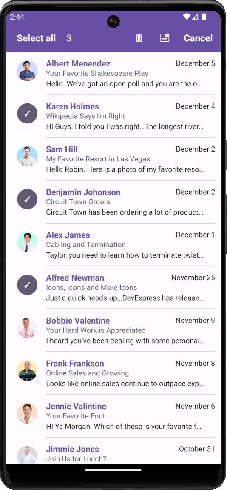

<!-- default badges list -->

<!-- default badges end -->
# DevExpress CollectionView for .NET MAUI - Enable Multiple Selection and Implement the Contextual Action Bar

This example shows how to use the [DXCollectionView.LongPress](https://docs.devexpress.com/MAUI/DevExpress.Maui.CollectionView.DXCollectionView.LongPress) event to enable multiple item selection.

 

## Implementation Details

* Handle the [DXCollectionView.LongPress](https://docs.devexpress.com/MAUI/DevExpress.Maui.CollectionView.DXCollectionView.LongPress) event and set the [DXCollectionView.SelectionMode](https://docs.devexpress.com/MAUI/DevExpress.Maui.CollectionView.DXCollectionView.SelectionMode) property to [Multiple](https://learn.microsoft.com/en-us/dotnet/api/microsoft.maui.controls.selectionmode?view=net-maui-8.0).
* Use the [DXCollectionView.SelectedItemTemplate](https://docs.devexpress.com/MAUI/DevExpress.Maui.CollectionView.DXCollectionView.SelectedItemTemplate) property to specify a template for selected items.
* You can create a `ContentView` descendant to implement common visual elements for a regular and selected templates. This example uses the `SelectableItem` (`ContentView` descendant) class that contains the `IsSelected` property. The appearance of this class is defined in the **itemBaseTemplate**.
* When a CollectionView item is selected, the application title displays custom actions. You can use the [Shell.TitleView](https://learn.microsoft.com/en-us/dotnet/maui/fundamentals/shell/pages?#display-views-in-the-navigation-bar) property to define these actions.

## Files to Review

<!-- default file list -->
* [MainPage.xaml](MainPage.xaml)
* [MainPage.xaml.cs](MainPage.xaml.cs)
* [MainViewModel.cs](MainViewModel.cs)
* [Converters.cs](Converters.cs)
* [App.xaml](App.xaml)
<!-- default file list end -->

## Documentation

* [DXCollectionView.LongPress](https://docs.devexpress.com/MAUI/DevExpress.Maui.CollectionView.DXCollectionView.LongPress)

## More Examples

* [Stocks App](https://github.com/DevExpress-Examples/maui-stocks-mini)
* [Demo Application](https://github.com/DevExpress-Examples/maui-demo-app)
