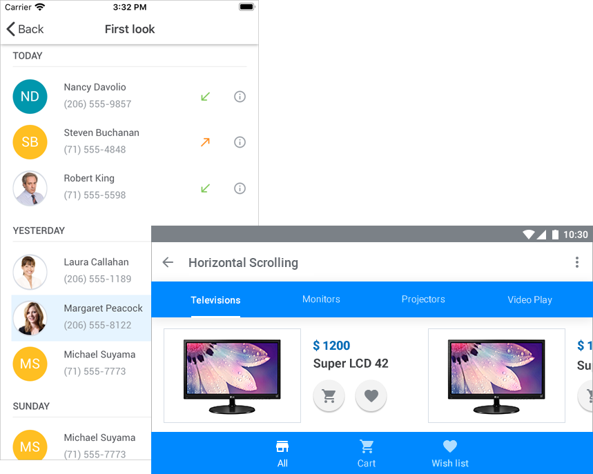

# DevExpress Collection View for .NET MAUI

This repository contains an application that demonstrates the capabilities of the **DevExpress Collection View for .NET MAUI** library. The **DevExpress.Maui.CollectionView.DXCollectionView** component uses a template to display a collection of data items in a single column or row. The component features include the following:

- Templates for Data Items and Group Headers
- Data Sorting, Filtering, and Grouping
- Vertical and Horizontal Scroll
- Drag-and-Drop Editing
- Pull-to-Refresh
- Infinite Scroll
- Swipe Gestures
- Multiple Item Selection
- Themes



## What's in This Repository

An example in this repository allows you to get started with the Collection View component and explore its basic functionality. It demonstrates how to bind the view to a data source, apply an item template, sort and group data items.


### Prerequisites

1. Install Visual Studio 2022 Preview 2 and .NET 6 Preview 6. See the following topic on docs.microsoft.com for more information: [.NET MAUI Installation](https://docs.microsoft.com/en-gb/dotnet/maui/get-started/installation).
1. Register the following NuGet feed in Visual Studio: **https://nuget.devexpress.com/free/api**.

## How to Create This Application

The step-by-step instructions below describe how to create the same application.

## Create a New Project

1. In Visual Studio 2022 Preview 2, create a new .NET MAUI project. Name it *CollectionViewExample*.
    > If the wizard does not propose a template for .NET MAUI projects, you can call the following command in the CLI to create a new .NET MAUI project:
    > ```
    > dotnet new maui -ap com.devexpress.CollectionViewExample
    > ```
1. Register the following NuGet feed in Visual Studio: **https://nuget.devexpress.com/free/api**.
1. Install the **DevExpress.Maui.CollectionView** package from this feed.

> DevExpress Controls for .NET MAUI support iOS and Android. If the wizard also created a WinUI project, remove it.

## View Model

Create the **ViewModel** and **Contact** classes as shown below. The **ViewModel** class exposes the **Data** property that provides access to the data source. Items in this collection are **Contact** objects that expose the **Name**, **Photo**, and **Phone** properties.

```cs
using Microsoft.Maui.Controls;
using System;
using System.Collections.Generic;
using System.ComponentModel;
using System.Runtime.CompilerServices;

namespace CollectionViewExample {
    public class Contact {
        string name;
        public string Name {
            get => this.name;
            set {
                this.name = value;
                if (Photo == null) {
                    string resourceName = value.Replace(" ", "").ToLower() + ".jpg";
                    Photo = ImageSource.FromFile(resourceName);
                }
            }
        }

        public Contact(string name, string phone) {
            Name = name;
            Phone = phone;
        }
        public ImageSource Photo { get; set; }
        public string Phone { get; set; }
    }

    public class ViewModel : INotifyPropertyChanged {
        public List<Contact> Data { get; }
        public ViewModel() {
            Data = new List<Contact>() {
                new Contact("Nancy Davolio", "(206) 555-9857"),
                new Contact("Andrew Fuller", "(206) 555-9482"),
                new Contact("Janet Leverling", "(206) 555-3412"),
                new Contact("Margaret Peacock", "(206) 555-8122"),
                new Contact("Steven Buchanan", "(71) 555-4848"),
                new Contact("Michael Suyama", "(71) 555-7773"),
                new Contact("Robert King", "(71) 555-5598"),
                new Contact("Laura Callahan", "(206) 555-1189"),
                new Contact("Anne Dodsworth", "(71) 555-4444"),
            };
        }

        public event PropertyChangedEventHandler PropertyChanged;
        private void OnPropertyChanged([CallerMemberName] string propertyName = "") {
            PropertyChanged?.Invoke(this, new PropertyChangedEventArgs(propertyName));
        }
    }
}
```

## View

In the *Startup.cs* file, [register a handler](https://docs.microsoft.com/en-us/dotnet/maui/fundamentals/app-startup#register-handlers) for the **DevExpress.Maui.CollectionView.DXCollectionView** class.

```cs
using Microsoft.Maui;
using Microsoft.Maui.Hosting;
using Microsoft.Maui.Controls.Hosting;
using Microsoft.Maui.Controls.Xaml;
using DevExpress.Maui.CollectionView;

[assembly: XamlCompilationAttribute(XamlCompilationOptions.Compile)]

namespace CollectionViewExample {
	public class Startup : IStartup {
		public void Configure(IAppHostBuilder appBuilder) {
			appBuilder
				.ConfigureMauiHandlers((_, handlers) => handlers.AddHandler<IDXCollectionView, DXCollectionViewHandler>())
				.UseMauiApp<App>()
				.ConfigureFonts(fonts => {
					fonts.AddFont("OpenSans-Regular.ttf", "OpenSansRegular");
				});
		}
	}
}
```

Do the following in the *MainPage.xaml* file:

1. Define the **dxcv** XAML namespace that refers to the **DevExpress.Maui.Charts** CLR namespace.
1. Define the **local** XML namespace that refers to the **CollectionViewExample** CLR namespace.
1. Remove the default content and add an instance of the **DXCollectionView** class to the page. You may also need to remove the default content's event handlers in the code-behind.
1. Assign a **ViewModel** instance to the **ContentPage.BindingContext** property.
1. Bind the **DXCollectionView.ItemsSource** property to the view model's **Data** property.
1. Use the **DisplayMember** property to specify the data field that contains item captions. The **DisplayFormat** allows you to format captions.

```xaml
<ContentPage xmlns="http://schemas.microsoft.com/dotnet/2021/maui"
             xmlns:x="http://schemas.microsoft.com/winfx/2009/xaml"
             xmlns:dxcv="clr-namespace:DevExpress.Maui.CollectionView;assembly=DevExpress.Maui.CollectionView"
             xmlns:local="clr-namespace:CollectionViewExample"
             x:Class="CollectionViewExample.MainPage"
             BackgroundColor="{DynamicResource PageBackgroundColor}">
    <ContentPage.BindingContext>
        <local:ViewModel/>
    </ContentPage.BindingContext>
    <dxcv:DXCollectionView ItemsSource="{Binding Data}"
                           DisplayMember="Name"
                           DisplayFormat="Contact: {0}"/>
</ContentPage>
```

Run the application. You can now see a Collection View on the start screen. The view displays a list of items from the bound data source.

### Item Template

The **DXCollectionView** supports *item templates*, which allow you to specify how each item appears in the view. Make the following changes in the *MainPage.xaml* file to define an item template:

1. Assign a **DataTemplate** to the **DXCollectionView.ItemTemplate** property.
1. Populate the template with controls and bind them to data source fields as the markup below demonstrates.

```xaml
<dxcv:DXCollectionView ItemsSource="{Binding Data}">
        <!--Define the item template.-->
        <dxcv:DXCollectionView.ItemTemplate>
            <DataTemplate>
                <Grid Padding="10, 8, 18, 7">
                    <Grid.ColumnDefinitions>
                        <ColumnDefinition Width="50"/>
                        <ColumnDefinition Width="*"/>
                    </Grid.ColumnDefinitions>
                    <Frame Grid.Column="0"
                       HasShadow="False"
                       BackgroundColor="LightGray"
                       VerticalOptions="Center"
                       HorizontalOptions="Center"
                       CornerRadius="25"
                       WidthRequest="50"
                       HeightRequest="50"
                       Padding="1">
                        <Frame BackgroundColor="White"
                           Padding="0"
                           HeightRequest="48"
                           WidthRequest="48"
                           VerticalOptions="Center"
                           HorizontalOptions="Center"
                           HasShadow="False"
                           IsClippedToBounds="True"
                           CornerRadius="24">
                            <Image Source="{Binding Photo}">
                                <Image.VerticalOptions>
                                    <OnPlatform x:TypeArguments="LayoutOptions">
                                        <On Platform="Android">FillAndExpand</On>
                                        <On Platform="iOS">EndAndExpand</On>
                                    </OnPlatform>
                                </Image.VerticalOptions>
                            </Image>
                        </Frame>
                    </Frame>
                    <StackLayout Grid.Column="1"
                             Padding="18,1,18,7"
                             Orientation="Vertical">
                        <Label Text="{Binding Name}"
                           Margin="0,2"
                           TextColor="#55575c"/>
                        <Label Text="{Binding Phone}"
                               TextColor="#959aa0"/>
                    </StackLayout>
                </Grid>
            </DataTemplate>
        </dxcv:DXCollectionView.ItemTemplate>
        
        <!--Specify margins.-->
        <dxcv:DXCollectionView.Margin>
            <OnIdiom x:TypeArguments="Thickness" Phone="16,0,0,0" Tablet="71,0,0,0"/>
        </dxcv:DXCollectionView.Margin>
</dxcv:DXCollectionView>
```

Do the following to add contact photos to the solution:
1. Download this repository from GitHub.
1. Copy images from the */CollectionViewExample/Resources/Images* folder in the downloaded repository to the same folder in your project.

Run the application. The Collection View now displays a photo, name, and phone number for each contact.


### Sort Data Items

Make the following changes in the *MainPage.xaml* file to sort data items:

1. Create a **SortDescription** object and specify its **FieldName** and **SortOrder** properties.
1. Add this object to the **DXCollectionView.SortDescriptions** collection.

```xaml
<dxcv:DXCollectionView ItemsSource="{Binding Data}">
        <!-- Define ItemTemplate here.-->

        <!--Sort items.-->
        <dxcv:DXCollectionView.SortDescriptions>
            <dxcv:SortDescription FieldName="Name" SortOrder="Descending"/>
        </dxcv:DXCollectionView.SortDescriptions>
</dxcv:DXCollectionView>
```

Run the application. Contacts are now sorted by name in descending order.


You can also sort list items by multiple data fields. To do this, create a **DevExpress.Maui.CollectionView.SortDescription** object for each field that should be sorted. The order of these objects in the **DXCollectionView.SortDescriptions** collection defines the sort order in the view.

### Group Data Items

Make the following changes in the *MainPage.xaml* file to group data items:

1. Set the **DXCollectionView.GroupDescription** property to a **GroupDescription** object with the **FieldName** property set to **Name** and **GroupDescription.GroupInterval** set to **Alphabetical**.
1. Use the **DXCollectionView.GroupHeaderTemplate** property to specify the appearance of group headers.

```xaml
<dxcv:DXCollectionView ItemsSource="{Binding Data}">
        <!-- Define ItemTemplate here.-->

        <!--Group items.-->
        <dxcv:DXCollectionView.GroupDescription>
            <dxcv:GroupDescription FieldName="Name" GroupInterval="Alphabetical"/>
        </dxcv:DXCollectionView.GroupDescription>

        <!--Define the group header template.-->
        <dxcv:DXCollectionView.GroupHeaderTemplate>
            <DataTemplate>
                <StackLayout Margin="2, 0, 18, 10">
                    <Label FontFamily="Roboto-Medium"
                       Margin="0,20,0,1"
                       TextColor="#55575c"
                       Text="{Binding Value}"/>
                    <BoxView BackgroundColor="#ebebeb" 
                         HeightRequest="1"/>
                </StackLayout>
            </DataTemplate>
        </dxcv:DXCollectionView.GroupHeaderTemplate>
</dxcv:DXCollectionView>
```

Run the application. Contacts whose first name starts with the same letter are now arranged into groups. Each group is identified by a header. Users can tap group headers to expand or collapse groups.

