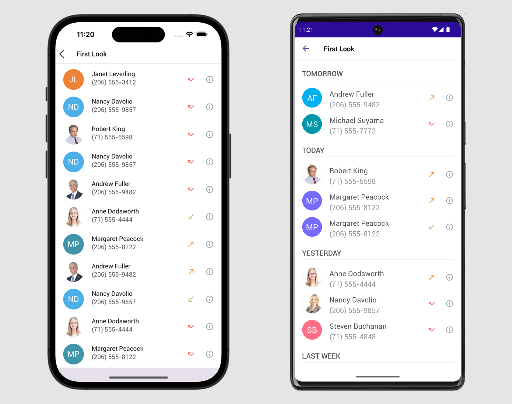
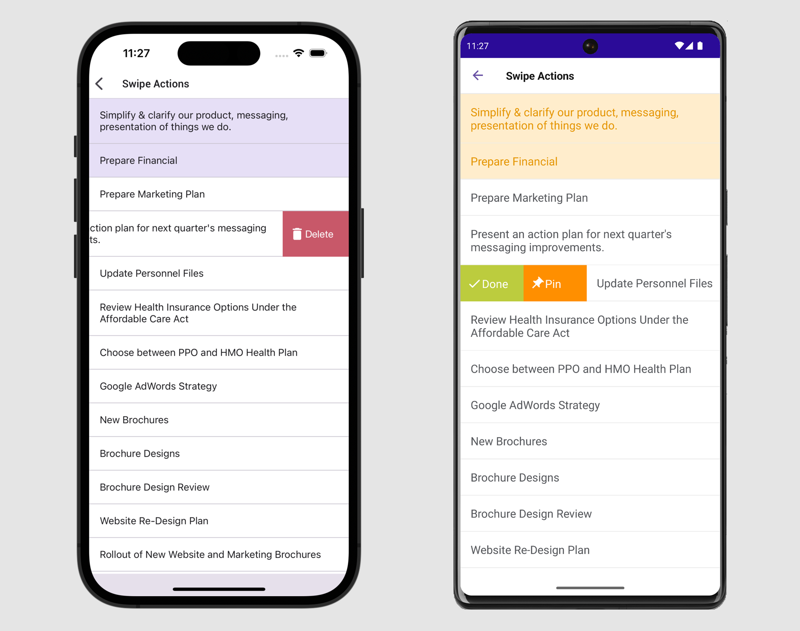
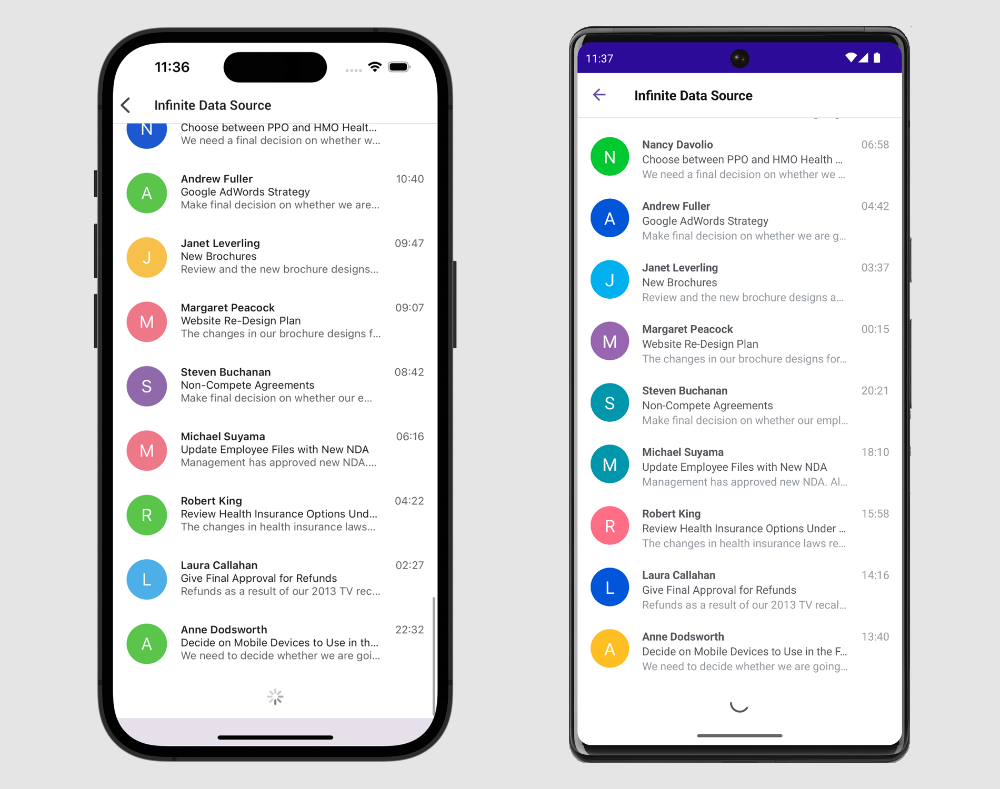

<!-- default badges list -->

<!-- default badges end -->
# DevExpress Collection View for .NET MAUI

[DevExpress Mobile UI](https://www.devexpress.com/maui/) allows you to use a .NET cross-platform UI toolkit and C# to build native apps for iOS and Android.

The **DevExpress Mobile UI for Xamarin.Forms and .NET MAUI** is free of charge. To learn more about our offer and to reserve your copy, visit [Free DevExpress Mobile UI for Xamarin.Forms and .NET MAUI](https://www.devexpress.com/xamarin-free).

## Requirements

Please register the DevExpress NuGet Gallery in Visual Studio to restore the NuGet packages used in this solution. See the following topic for more information: [Get Started with DevExpress Mobile UI for .NET MAUI](https://docs.devexpress.com/MAUI/403249/get-started).

## What's in This Repository

The [DXCollectionView](https://docs.devexpress.com/MAUI/DevExpress.Maui.CollectionView.DXCollectionView) component uses a template to display a collection of data items in a vertical or horizontal list. See the following help topic for more information: [Collection View](https://docs.devexpress.com/MAUI/403324/collection-view/index).

Samples in this repository demonstrate how to get started with the [DXCollectionView](https://docs.devexpress.com/MAUI/DevExpress.Maui.CollectionView.DXCollectionView) component and how to use its features.

### Get Started

The *CollectionViewExample* project demonstrates how to populate the view with items, apply data templates, sort and group items.

#### Files to Look At

<!-- default file list -->
* [MainPage.xaml](./CS/CollectionViewExample/MainPage.xaml)
* [ViewModel.cs](./CS/CollectionViewExample/ViewModel.cs)
<!-- default file list end -->

### Selection

The *CollectionViewSelection* project demonstrates how to enable multiple item selection and apply a custom data template to selected items.

#### Files to Look At

<!-- default file list -->
* [MainPage.xaml](./CS/CollectionViewSelection/MainPage.xaml)
* [ViewModel.cs](./CS/CollectionViewSelection/ViewModel.cs)
<!-- default file list end -->

### Swipe

The *CollectionViewSwipe* project demonstrates item-related commands that a user can access with a swipe gesture.

#### Files to Look At

<!-- default file list -->
* [MainPage.xaml](./CS/CollectionViewSwipe/MainPage.xaml)
* [ViewModel.cs](./CS/CollectionViewSwipe/ViewModel.cs)

### Load-More

The *CollectionViewLoadMore* project demonstrates a list that is automatically updated when a user scrolls to the end.

#### Files to Look At

<!-- default file list -->
* [MainPage.xaml](./CS/CollectionViewLoadMore/MainPage.xaml)
* [ViewModel.cs](./CS/CollectionViewLoadMore/ViewModel.cs)
* [MailMessageRepository.cs](./CS/CollectionViewLoadMore/MailMessageRepository.cs)

### Pull-to-Refresh

The *CollectionViewPullToRefresh* project demonstrates a list that is updated with a pull-down gesture.

#### Files to Look At

<!-- default file list -->
* [MainPage.xaml](./CS/CollectionViewPullToRefresh/MainPage.xaml)
* [ViewModel.cs](./CS/CollectionViewPullToRefresh/ViewModel.cs)
* [MailMessageRepository.cs](./CS/CollectionViewPullToRefresh/MailMessageRepository.cs)
<!-- default file list end -->

## Documentation

- [Collection View](https://docs.devexpress.com/MAUI/403324/collection-view/index)
- [Data Grid](https://docs.devexpress.com/MAUI/403255/data-grid/data-grid)
- [Charts](https://docs.devexpress.com/MAUI/403300/charts/charts)
- [Data Form](https://docs.devexpress.com/MAUI/403640/data-form)
- [Navigation](https://docs.devexpress.com/MAUI/403297/navigation/index)
- [Data Editors](https://docs.devexpress.com/MAUI/403427/editors/index)

## More Examples

* [Stocks App](https://github.com/DevExpress-Examples/maui-stocks-mini)
* [Data Grid](https://github.com/DevExpress-Examples/maui-data-grid-get-started)
* [Data Form](https://github.com/DevExpress-Examples/maui-data-form-get-started)
* [Data Editors](https://github.com/DevExpress-Examples/maui-editors-get-started)
* [Pie Chart](https://github.com/DevExpress-Examples/maui-pie-chart-get-started)
* [Scatter Chart](https://github.com/DevExpress-Examples/maui-scatter-chart-get-started)
* [Tab View](https://github.com/DevExpress-Examples/maui-tab-view-get-started)